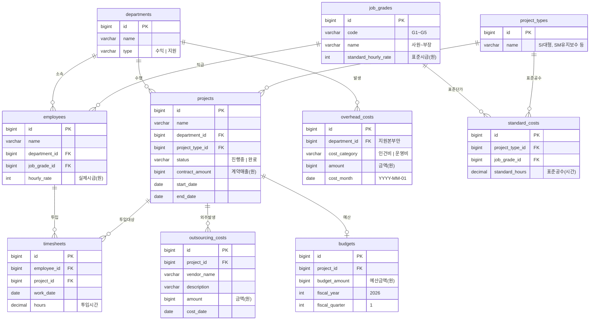

# 📋 ERD 모델: CostPilot 데이터베이스 설계

> **프로젝트명**: CostPilot — 원가/관리회계 통합관리 시스템  
> **문서 버전**: v1.0  
> **작성일**: 2026-04-21  
> **작성자**: 정찬우

---

## 1. ERD 다이어그램

---

## 2. 테이블 상세 명세

### 2.1 기준 데이터 (Read Only — 최초 기동 시 자동 생성)

#### departments (본부)

| 컬럼 | 타입 | 제약 | 설명 |
|---|---|---|---|
| id | BIGSERIAL | PK | |
| name | VARCHAR(100) | NOT NULL | 본부명 |
| type | VARCHAR(20) | NOT NULL | `수익` / `지원` |

#### job_grades (직급)

| 컬럼 | 타입 | 제약 | 설명 |
|---|---|---|---|
| id | BIGSERIAL | PK | |
| code | VARCHAR(10) | UNIQUE | `G1` ~ `G5` |
| name | VARCHAR(50) | NOT NULL | 사원, 대리, 과장/선임, 차장/책임, 부장/수석 |
| standard_hourly_rate | INTEGER | NOT NULL | 표준시급 (원). CRUD 가능 |

> `standard_hourly_rate`는 관리자가 수정 가능 (CRU). 변경 시 차이 분석 결과가 달라진다.

#### employees (인력)

| 컬럼 | 타입 | 제약 | 설명 |
|---|---|---|---|
| id | BIGSERIAL | PK | |
| name | VARCHAR(100) | NOT NULL | |
| department_id | BIGINT | FK → departments | 소속 본부 |
| job_grade_id | BIGINT | FK → job_grades | 직급 |
| hourly_rate | INTEGER | NOT NULL | 실제 시급 (원) |

#### project_types (프로젝트 유형)

| 컬럼 | 타입 | 제약 | 설명 |
|---|---|---|---|
| id | BIGSERIAL | PK | |
| name | VARCHAR(100) | NOT NULL | SI 대형, SM 유지보수, ISP/BPR 등 |

> **IT 서비스 업계 프로젝트 유형 용어 설명**
> * **SI 신규개발 (대형/중형)**: **S**ystem **I**ntegration. 고객의 요구사항에 맞춰 새로운 IT 시스템이나 소프트웨어를 기획부터 개발, 구축까지 책임지는 프로젝트.
> * **패키지 커스터마이징**: SAP, DB 등 이미 만들어진 기성 소프트웨어(패키지)를 도입하고, 고객사 환경에 맞게 일부 기능을 수정하거나 설정하는 프로젝트.
> * **SM 유지보수**: **S**ystem **M**aintenance. 이미 구축되어 운영 중인 시스템의 오류를 수정하거나, 성능을 개선하고, 약간의 기능을 추가하며 지속적으로 관리해주는 프로젝트.
> * **운영대행**: 고객사의 IT 인프라(서버, 네트워크 등)나 시스템 관리를 회사 측에서 통째로 위탁받아 일상적으로 운영해주는 서비스.
> * **ISP/BPR 컨설팅**: **ISP**(Information Strategy Planning)는 전체 IT 전략 수립. **BPR**(Business Process Reengineering)은 기존 업무 방식을 분석해 IT 기술로 효율화할 수 있는 새로운 업무 프로세스를 설계하는 정보화 컨설팅.
> * **PMO**: **P**roject **M**anagement **O**ffice. 고객사를 대신해서 진행 중인 대형 SI 프로젝트 전체를 총괄 관리, 감독하고 리스크와 일정을 통제하는 업무. (주로 고급 인력이 투입됨)
> 
> ※ **유형 구분의 필요성**: 각 프로젝트 유형마다 투입되는 인원(직급 구성)과 예상되는 소요 시간(공수)의 평균치가 크게 다르기 때문에, 이를 기준으로 **'표준공수'**를 산출하기 위함.

#### projects (프로젝트)

| 컬럼 | 타입 | 제약 | 설명 |
|---|---|---|---|
| id | BIGSERIAL | PK | |
| name | VARCHAR(200) | NOT NULL | 프로젝트명 |
| department_id | BIGINT | FK → departments | 소속 수익본부 |
| project_type_id | BIGINT | FK → project_types | 유형 |
| status | VARCHAR(20) | NOT NULL | `진행중` / `완료` |
| contract_amount | BIGINT | NOT NULL | 계약 매출 금액 (원) |
| start_date | DATE | | 시작일 |
| end_date | DATE | | 종료일 |

---

### 2.2 거래 데이터 (Full CRUD)

#### timesheets (투입 공수)

| 컬럼 | 타입 | 제약 | 설명 |
|---|---|---|---|
| id | BIGSERIAL | PK | |
| employee_id | BIGINT | FK → employees | 투입 인력 |
| project_id | BIGINT | FK → projects | 투입 프로젝트 |
| work_date | DATE | NOT NULL | 작업일 |
| hours | DECIMAL(5,1) | NOT NULL | 투입 시간 |

> 원가 집계·차이 분석의 핵심 입력. 수정 시 모든 분석 결과가 연동 변경된다.

#### outsourcing_costs (외주비)

| 컬럼 | 타입 | 제약 | 설명 |
|---|---|---|---|
| id | BIGSERIAL | PK | |
| project_id | BIGINT | FK → projects | 귀속 프로젝트 |
| vendor_name | VARCHAR(200) | | 외주 업체명 |
| description | VARCHAR(500) | | 내역 |
| amount | BIGINT | NOT NULL | 금액 (원) |
| cost_date | DATE | NOT NULL | 발생일 |

#### overhead_costs (간접비 — 지원본부 비용)

| 컬럼 | 타입 | 제약 | 설명 |
|---|---|---|---|
| id | BIGSERIAL | PK | |
| department_id | BIGINT | FK → departments | 지원본부 (D4, D5) |
| cost_category | VARCHAR(50) | NOT NULL | `인건비` / `운영비` |
| amount | BIGINT | NOT NULL | 금액 (원) |
| cost_month | DATE | NOT NULL | 해당 월 (YYYY-MM-01) |

---

### 2.3 설정 데이터 (CRU — 삭제 제한)

#### standard_costs (표준공수 기준)

| 컬럼 | 타입 | 제약 | 설명 |
|---|---|---|---|
| id | BIGSERIAL | PK | |
| project_type_id | BIGINT | FK → project_types | 프로젝트 유형 |
| job_grade_id | BIGINT | FK → job_grades | 직급 |
| standard_hours | DECIMAL(8,1) | NOT NULL | 해당 유형·직급의 표준 공수 (시간) |

> 유니크 제약: (project_type_id, job_grade_id) — 유형+직급 조합당 1건

#### budgets (예산)

| 컬럼 | 타입 | 제약 | 설명 |
|---|---|---|---|
| id | BIGSERIAL | PK | |
| project_id | BIGINT | FK → projects, UNIQUE | 프로젝트당 1건 |
| budget_amount | BIGINT | NOT NULL | 예산 금액 (원) |
| fiscal_year | INTEGER | NOT NULL | 회계연도 (2026) |
| fiscal_quarter | INTEGER | NOT NULL | 분기 (1) |

---

## 3. CRUD 권한 매트릭스

| 테이블 | Create | Read | Update | Delete | 비고 |
|---|---|---|---|---|---|
| departments | 자동 생성 | ✅ | ❌ | ❌ | 기준 데이터 |
| job_grades | 자동 생성 | ✅ | ✅ 시급만 | ❌ | 표준시급 변경 → 차이분석 연동 |
| employees | 자동 생성 | ✅ | ❌ | ❌ | 기준 데이터 |
| project_types | 자동 생성 | ✅ | ❌ | ❌ | 기준 데이터 |
| projects | 자동 생성 | ✅ | ❌ | ❌ | 기준 데이터 |
| **timesheets** | ✅ | ✅ | ✅ | ✅ | **핵심 거래 데이터** |
| **outsourcing_costs** | ✅ | ✅ | ✅ | ✅ | 거래 데이터 |
| **overhead_costs** | ✅ | ✅ | ✅ | ✅ | 거래 데이터 |
| **standard_costs** | 자동 생성 | ✅ | ✅ | ❌ | 표준공수 변경 → 차이분석 연동 |
| **budgets** | ✅ | ✅ | ✅ | ✅ | 예산 관리 |

---

## 4. 분석 쿼리와 테이블 매핑

분석 결과는 별도 테이블에 저장하지 않고, 아래 테이블 조합으로 **실시간 계산**한다.

| 분석 기능 | 사용 테이블 | 계산 방식 |
|---|---|---|
| **COST-STAFF** | timesheets + employees + job_grades | `SUM(hours × hourly_rate)` GROUP BY employee |
| **COST-PROJECT** | timesheets + employees + outsourcing_costs + (배분된 overhead) | 직접인건비 + 외주비 + 배분 간접원가 |
| **COST-DEPT** | 위 결과 GROUP BY department | 본부 소속 프로젝트 원가 합산 |
| **COST-TOTAL** | 위 결과 전체 합산 + projects.contract_amount | 원가율 = 총원가 / 총매출 |
| **TRANSFER-SIM** | overhead_costs + departments + (Driver 선택) | Cost Pool × Driver 비율 |
| **STD-COMPARE** | standard_costs + job_grades vs. timesheets + employees | 표준원가 vs. 실제원가 비교 |
| **VAR-LABOR** | employees.hourly_rate vs. job_grades.standard_hourly_rate + timesheets vs. standard_costs | 임률차이 + 능률차이 |
| **VAR-OVERHEAD** | overhead_costs vs. 배부율 기준 | 예산차이 + 능률차이 + 조업도차이 |
| **VAR-BUDGET** | budgets.budget_amount vs. 실제원가 합계 | 소진율 계산 |
| **PERF-MARGIN** | projects.contract_amount - 직접원가 - 내부대체가액 | 공헌이익 산출 |
| **PERF-UTIL** | timesheets.hours / (176h × months) | 가동률 계산 |
| **PERF-PROFIT** | contract_amount vs. 총원가 | 이익률·등급 |

---

## 5. 데이터 볼륨 (Mock Data)

| 테이블 | 예상 레코드 수 | 산출 근거 |
|---|---|---|
| departments | 5 | 수익 3 + 지원 2 |
| job_grades | 5 | G1 ~ G5 |
| employees | 80 | 본부별 분배 |
| project_types | 7 | SI대형/중형, 패키지, SM, 운영대행, ISP/BPR, PMO |
| projects | 20 | 본부당 4~8개 |
| timesheets | ~4,800 | 80명 × 약 60일(3개월) |
| outsourcing_costs | ~30 | SI/패키지 프로젝트 위주 |
| overhead_costs | ~12 | 지원 2본부 × 2비목 × 3개월 |
| standard_costs | ~35 | 7유형 × 5직급 |
| budgets | 20 | 프로젝트당 1건 |

**총 약 5,000건** — 프로토타입으로 충분한 규모

---

> **다음 단계**: `04_api_spec.md` — API 명세서 작성
