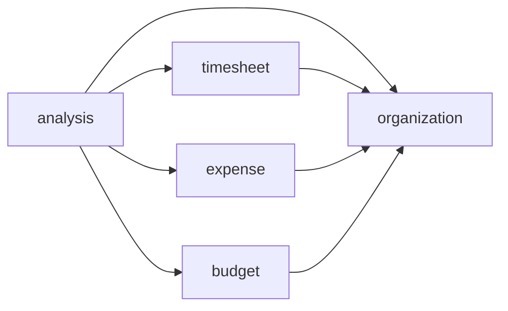

# 📋 Backend 아키텍처 설계서

> **프로젝트명**: CostPilot — 원가/관리회계 통합관리 시스템  
> **문서 버전**: v1.0  
> **작성일**: 2026-04-22  
> **작성자**: 정찬우  
> **관련 문서**: `01_project_plan.md`, `03_erd.md`, `04_api_spec.md`

---

## 1. 아키텍처 원칙: 헥사고날 (Ports & Adapters)

비즈니스 로직(Domain)을 외부 기술(DB, Web)로부터 완전히 분리한다.

```
Controller (Driving Adapter)
    → UseCase / InputPort (Interface)
        → Domain Service (구현체, 순수 비즈니스 로직)
            → OutputPort / Repository (Interface)
                → JPA Adapter (Driven Adapter)
```

**의존 규칙**: 바깥 → 안쪽. Domain은 어떤 외부 기술도 모른다.

| 계층 | 역할 | 의존 허용 |
|---|---|---|
| **Domain (Model)** | 엔티티, VO, 비즈니스 규칙 | 없음 (순수 POJO) |
| **Domain (Service)** | 유스케이스 구현 | Model, OutputPort(인터페이스) |
| **Port (Input)** | 유스케이스 인터페이스 | Model |
| **Port (Output)** | 영속성 인터페이스 | Model |
| **Adapter (Web)** | REST Controller, DTO | InputPort, Model |
| **Adapter (Persistence)** | JPA Repository 구현 | OutputPort, Model, JPA |

---

## 2. 도메인 분할 (5개 Bounded Context)

| 도메인 | 담당 테이블 | API 경로 | 핵심 책임 |
|---|---|---|---|
| **organization** | departments, employees, projects, project_types, job_grades | `/api/departments`, `/api/employees`, `/api/projects`, `/api/project-types`, `/api/job-grades` | 조직·인력·프로젝트 기준 데이터 |
| **timesheet** | timesheets | `/api/timesheets` | 투입 공수 CRUD |
| **expense** | outsourcing_costs, overhead_costs | `/api/outsourcing-costs`, `/api/overhead-costs` | 외주비·간접비 CRUD |
| **budget** | budgets, standard_costs | `/api/budgets`, `/api/standard-costs` | 예산·표준원가 관리 |
| **analysis** | (저장 테이블 없음) | `/api/analysis/**` | M1~M5 실시간 분석 계산 |

### 도메인 간 의존



> `analysis`는 다른 4개 도메인 데이터를 **읽기 전용** 참조. 나머지는 `organization`만 참조.

---

## 3. 디렉토리 구조

```
backend/src/main/java/com/costpilot/
├── CostPilotApplication.java
├── global/
│   ├── config/        (WebConfig, JpaConfig)
│   ├── exception/     (GlobalExceptionHandler, BusinessException, ErrorResponse)
│   └── init/          (DataInitializer — Mock Data 시딩)
│
├── organization/      ← 도메인 1
│   ├── domain/        (Department, Employee, Project, ProjectType, JobGrade)
│   ├── port/in/       (OrganizationQueryUseCase)
│   ├── port/out/      (DepartmentRepository, EmployeeRepository, ...)
│   ├── service/       (OrganizationQueryService)
│   └── adapter/
│       ├── web/       (Controllers + dto/)
│       └── persistence/ (Jpa*Repository)
│
├── timesheet/         ← 도메인 2
│   ├── domain/        (Timesheet)
│   ├── port/          (TimesheetUseCase, TimesheetRepository)
│   ├── service/       (TimesheetService)
│   └── adapter/       (web/ + persistence/)
│
├── expense/           ← 도메인 3
│   ├── domain/        (OutsourcingCost, OverheadCost)
│   ├── port/          (ExpenseUseCase, *Repository)
│   ├── service/       (ExpenseService)
│   └── adapter/       (web/ + persistence/)
│
├── budget/            ← 도메인 4
│   ├── domain/        (Budget, StandardCost)
│   ├── port/          (BudgetUseCase, *Repository)
│   ├── service/       (BudgetService)
│   └── adapter/       (web/ + persistence/)
│
└── analysis/          ← 도메인 5 (조회 전용)
    ├── domain/        (CostAggregation, TransferPricing, StandardAllocation, VarianceAnalysis, PerformanceAnalysis)
    ├── port/in/       (각 모듈 UseCase 인터페이스)
    ├── service/       (CostAggregationService, TransferPricingService, StandardAllocationService, VarianceAnalysisService, PerformanceAnalysisService)
    └── adapter/web/   (각 모듈 Controller + dto/)
```

---

## 4. 기술 스택

| 항목 | 기술 | 버전 |
|---|---|---|
| Framework | Spring Boot | 3.4.x |
| Language | Java | 21 (LTS) |
| Build | Gradle (Groovy DSL) | 8.5 |
| ORM | Spring Data JPA + Hibernate | — |
| DB Driver | PostgreSQL JDBC | 42.x |
| Validation | Jakarta Bean Validation | — |
| Monitoring | Spring Boot Actuator | — |

### build.gradle 핵심 의존성

```groovy
plugins {
    id 'java'
    id 'org.springframework.boot' version '3.4.4'
    id 'io.spring.dependency-management' version '1.1.7'
}

group = 'com.costpilot'
version = '0.0.1-SNAPSHOT'
java { toolchain { languageVersion = JavaLanguageVersion.of(21) } }

dependencies {
    implementation 'org.springframework.boot:spring-boot-starter-web'
    implementation 'org.springframework.boot:spring-boot-starter-data-jpa'
    implementation 'org.springframework.boot:spring-boot-starter-validation'
    implementation 'org.springframework.boot:spring-boot-starter-actuator'
    runtimeOnly 'org.postgresql:postgresql'
    compileOnly 'org.projectlombok:lombok'
    annotationProcessor 'org.projectlombok:lombok'
    testImplementation 'org.springframework.boot:spring-boot-starter-test'
    testRuntimeOnly 'com.h2database:h2'
}
```

### application.yml 핵심

```yaml
server:
  port: 8081
spring:
  application.name: costpilot-backend
  jpa:
    open-in-view: false
    properties.hibernate:
      default_batch_fetch_size: 100
management:
  endpoints.web.exposure.include: health,info
```

| Profile | ddl-auto | show-sql | 용도 |
|---|---|---|---|
| dev | create-drop | true | 로컬 개발 (매 기동 시 초기화) |
| prod | update | false | 서버 배포 |

---

## 5. 핵심 인프라 컴포넌트

### 5.1 DataInitializer (Mock Data 시딩)

```java
@Component
public class DataInitializer implements CommandLineRunner {
    @Override
    @Transactional
    public void run(String... args) {
        if (departmentRepository.count() > 0) return; // 이미 초기화 → 스킵
        // 1. 본부 5개  2. 직급 5개  3. 유형 7개  4. 인력 80명
        // 5. 프로젝트 20개  6. 공수 ~4,800건  7. 외주비 ~30건
        // 8. 간접비 ~12건  9. 표준공수 35건  10. 예산 20건
    }
}
```

### 5.2 GlobalExceptionHandler

| 예외 | HTTP Status | 처리 |
|---|---|---|
| BusinessException | 동적 (400/404) | 도메인 비즈니스 오류 |
| MethodArgumentNotValidException | 400 | @Valid 검증 실패 |
| Exception | 500 | 예상치 못한 오류 |

### 5.3 Dockerfile (Multi-stage)

```dockerfile
FROM gradle:8.5.0-jdk21 AS builder
WORKDIR /app
COPY . .
RUN gradle bootJar --no-daemon -x test

FROM eclipse-temurin:21-jre-alpine
WORKDIR /app
COPY --from=builder /app/build/libs/*.jar app.jar
EXPOSE 8081
ENTRYPOINT ["java", "-jar", "app.jar"]
```

---

## 6. 분석 도메인 핵심 로직 (의사코드)

### M1 원가 집계

```
COST-STAFF:  SUM(timesheet.hours × employee.hourlyRate) GROUP BY employee
COST-PROJECT: directLabor + outsourcing + allocatedOverhead
COST-DEPT:   SUM(projectCost) GROUP BY department
COST-TOTAL:  SUM(all) → costRate = totalCost / totalRevenue × 100
```

### M4 원가 요인 분석

```
FOR EACH jobGrade in project:
  rateVariance     = (actualRate - standardRate) × actualHours
  efficiencyVariance = (actualHours - standardHours) × standardRate
totalVariance = rateVariance + efficiencyVariance
judgement = totalVariance > 0 ? "U" : "F"
```

---

## 7. 트랜잭션·성능 전략

| 유형 | 전략 | 이유 |
|---|---|---|
| CRUD (C/U/D) | `@Transactional` | 데이터 정합성 보장 |
| 조회 (R) | `@Transactional(readOnly = true)` | Flush 비활성으로 성능 최적화 |
| 분석 API | `@Transactional(readOnly = true)` + JPQL 집계 | DB 레벨 집계, N+1 방지 |

---

## 8. API-아키텍처 매핑 요약

| API 경로 | 도메인 | Service |
|---|---|---|
| `/api/departments`, `/api/employees`, `/api/projects`, `/api/project-types`, `/api/job-grades` | organization | OrganizationQueryService |
| `/api/timesheets` | timesheet | TimesheetService |
| `/api/outsourcing-costs`, `/api/overhead-costs` | expense | ExpenseService |
| `/api/budgets`, `/api/standard-costs` | budget | BudgetService |
| `/api/analysis/cost/**` | analysis | CostAggregationService |
| `/api/analysis/transfer/**` | analysis | TransferPricingService |
| `/api/analysis/standard/**` | analysis | StandardAllocationService |
| `/api/analysis/variance/**` | analysis | VarianceAnalysisService |
| `/api/analysis/performance/**` | analysis | PerformanceAnalysisService |

---

> **다음 단계**: `06_frontend_architecture.md` — Frontend 아키텍처 설계서
